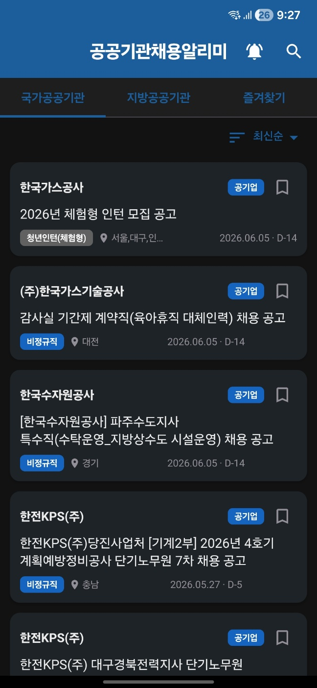

# 공공기관채용알리미 (JobAlarm)

기획재정부 **공공기관 채용정보 조회서비스 (ALIO, 데이터셋 ID 15125273)** 를 기반으로 공공기관 채용공고를 모아보고, 관심 기관의 새 공고가 뜨면 자동으로 푸시 알림을 보내주는 안드로이드 앱입니다.

<p align="center">
  
</p>

## 주요 기능

- 전체 채용공고 조회 (최신순 / 마감임박순 / 기관명순 정렬)
- 카테고리별 조회 (공기업 A / 준정부기관 B / 기타공공기관 C / 지방공기업 D)
- 공고 상세 + 원문 링크 + 공유 + 즐겨찾기(북마크)
- 실시간 검색 (공고명/기관명, 300ms debounce, 최근 검색어 저장)
- 관심 기관 등록 → **15분 주기 WorkManager 백그라운드 동기화**로 새 공고 즉시 알림
- 알림 → 공고 상세로 이동하는 딥링크 (`jobalarm://detail/{recrutPbancSn}`)

## 기술 스택

- Kotlin, Gradle Kotlin DSL, Version Catalog (`gradle/libs.versions.toml`)
- Jetpack Compose (Material3) + Navigation Compose
- Clean Architecture (data / domain / presentation)
- Hilt (DI) + KSP
- Room (5개 엔티티)
- Retrofit2 + OkHttp3 + Kotlinx Serialization
- WorkManager (Hilt 연동)
- Coil (이미지 로딩 준비)

## 사전 준비

1. **JDK 17** 설치 (Android Studio 번들 JDK 사용 가능)
   - Android Studio 사용 시: `File → Project Structure → SDK Location`에서 JDK 17 선택
   - 단독 설치 시: [Adoptium Temurin 17](https://adoptium.net/) 권장
2. **Android Studio Hedgehog (2023.1.1) 이상** 설치 — Android SDK, Platform-Tools, 에뮬레이터 번들 포함
3. Android Studio에서 **SDK Manager → compileSdk 34 / targetSdk 34 / Build Tools 34.0.0** 설치
4. `local.properties`에 `sdk.dir` 경로가 자동 설정되는지 확인 (Android Studio로 열면 자동 생성)

## 빌드 방법

### 1) Android Studio에서 (권장)

1. Android Studio → `Open` → `project4` 폴더 선택
2. 최초 열람 시 Gradle Sync 대기 (1~5분, 의존성 다운로드 필요)
3. 상단의 `Run 'app'` (Shift+F10) 클릭

### 2) 명령줄에서

```bash
# Windows (PowerShell 또는 CMD)
gradlew.bat assembleDebug

# Git Bash / macOS / Linux
./gradlew assembleDebug
```

APK는 `app/build/outputs/apk/debug/app-debug.apk`로 생성됩니다.

> **이 환경(코드 생성 시점)에서는 JDK/Android SDK 미설치로 `./gradlew`를 실행하지 않았습니다.** 처음 Android Studio에서 열 때 Gradle Sync 과정에서 의존성 버전 충돌이 감지되면 `gradle/libs.versions.toml`의 버전을 조정하세요.

## API 키 발급 방법

이 앱은 공공데이터포털의 **기획재정부_공공기관 채용정보 조회서비스** API를 사용합니다. 실제로 데이터를 받으려면 본인 이름으로 인증키를 발급해야 합니다.

1. 브라우저에서 <https://www.data.go.kr> 접속 후 로그인 (회원가입 필요)
2. 상단 검색창에 **"기획재정부_공공기관 채용정보 조회서비스"** 입력 (또는 데이터셋 ID `15125273` 검색)
3. 검색 결과에서 해당 오픈 API 상세 페이지로 진입
4. 우측 상단의 **"활용신청"** 버튼 클릭
5. 활용 목적을 간단히 작성 후 제출 (대부분 즉시 승인)
6. 상단 메뉴 **마이페이지 → 오픈API → 개발계정 상세보기** 이동
7. 발급된 **일반 인증키(Encoding)** 문자열을 복사
8. 프로젝트 루트의 `local.properties` 파일에 아래와 같이 붙여넣기:

```properties
PUBLIC_DATA_API_KEY=발급받은_인증키를_여기에_붙여넣기
```

9. Android Studio에서 **"Sync Project with Gradle Files"** 후 재빌드

> 주의: 발급받은 Encoding 키(%가 포함된 문자열)를 그대로 사용하세요. 디코딩된 키(`+` `=` 포함)를 넣으면 "SERVICE_KEY_IS_NOT_REGISTERED_ERROR"가 발생합니다. 만약 Decoding 키가 발급되었다면 URL 인코딩을 해서 넣어야 합니다.
>
> `local.properties`는 `.gitignore`에 이미 포함되어 커밋되지 않습니다. 절대 키를 저장소에 커밋하지 마세요.

## 프로젝트 구조

```
app/src/main/java/com/public/jobalarm/
├── data/
│   ├── remote/{api,dto}       # Retrofit API, 응답 DTO
│   ├── local/{entity,dao}     # Room 엔티티/DAO + AppDatabase
│   ├── repository             # Repository 구현체
│   └── mapper                 # DTO → Entity → Domain 변환
├── domain/
│   ├── model                  # 도메인 모델 (JobPosting, AlertOrg, Category, UiState)
│   ├── repository             # Repository 인터페이스
│   └── usecase                # UseCase
├── presentation/
│   ├── main                   # 메인 홈 (탭 3개)
│   ├── category               # 카테고리 상세
│   ├── detail                 # 공고 상세
│   ├── alert                  # 알림 설정
│   ├── search                 # 전체 화면 검색 오버레이
│   ├── component              # 공용 Compose 컴포넌트
│   ├── navigation             # AppNavHost, Screen
│   └── theme                  # Theme/Color/Typography
├── worker                     # JobSyncWorker + NotificationHelper
├── di                         # Hilt 모듈 (Network/Database/Repository)
└── util                       # DateUtils, Constants, SingleItemOrArrayDeserializer
```

## 권한

- `INTERNET`, `ACCESS_NETWORK_STATE`
- `POST_NOTIFICATIONS` (Android 13+)
- `SCHEDULE_EXACT_ALARM`
- `REQUEST_IGNORE_BATTERY_OPTIMIZATIONS` (배터리 최적화 예외 권장)

## 라이선스

본 앱은 학습/포트폴리오 용도로 작성되었습니다. ALIO API 사용 시 공공데이터포털의 이용약관을 준수해야 합니다.
